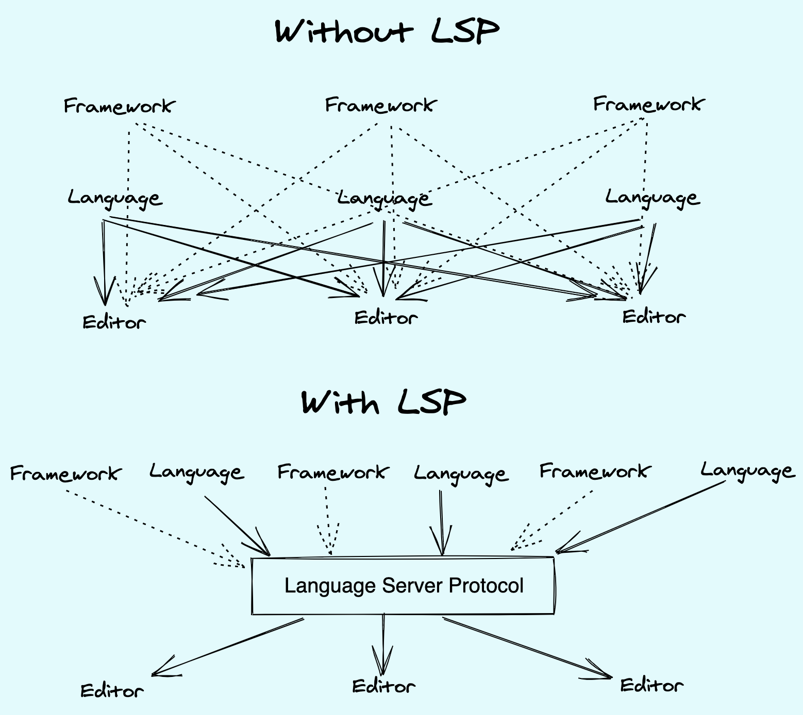

# Pycimen LSP

# Integrating a Language Server in a Visual Studio Code Extension

Pycimen LSP is an implementation of the Language Server Protocol (LSP) for Python. This document explains what LSP is, how it works, and how to use Pycimen LSP with VSCode.

## What is the Language Server Protocol (LSP)?

LSP is a standard communication protocol between modern code editors and IDEs. Developed by Microsoft, this protocol facilitates communication between language servers and clients. This enables language features such as code completion, debugging, symbol information, and more to be used independently of the editor.

## How Does LSP Work?

### Core Components

1. **Client**: The text editor or IDE that the user interacts with (e.g., VSCode).
2. **Server**: The backend service that provides language features for a specific programming language (e.g., Pycimen LSP).

### Communication Process

1. **Initialization**: The client starts the server and sends configuration information.
2. **Document Opening**: When a user opens a file, the client informs the server.
3. **Code Editing**: When a user makes changes to the code, the client notifies the server of these changes.
4. **Requests and Responses**: The client sends requests to the server for services like code completion and debugging, and the server responds.

### References

1. [Visual Studio Code - Language Server Extension Guide](https://code.visualstudio.com/api/language-extensions/language-server-extension-guide)
2. [Symflower Blog - LSP in VSCode Extension](https://symflower.com/en/company/blog/2022/lsp-in-vscode-extension/)

